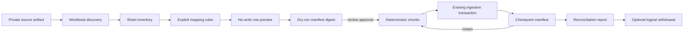
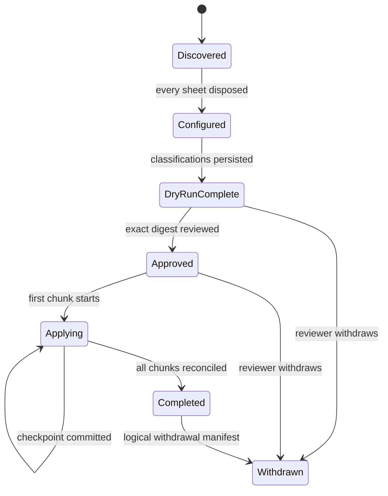

# feat: Add the bulk legacy migration workbench

## Goal Capsule

Give a tenant-scoped Results Desk operator a safe way to inventory an uploaded
legacy workbook, explicitly choose and map sheets, run a no-write classification,
obtain review approval, resume bounded publication after interruption, and export a
reconciliation report. The source workbook, every mapping decision, every row
classification, each committed checkpoint, and the logical withdrawal manifest
remain auditable.

This phase uses synthetic fixtures and isolated databases only. It does not ingest
the real legacy corpus, auto-link a person, enable a portable career fact, publish a
profile, deploy a worker, or write to STRATHMARK.

---

## Problem Frame

The current Results Desk can ingest one explicitly selected worksheet. The known
legacy event workbooks contain dozens of sheets and use layouts that cannot be
treated as one canonical table. Repeating the single-sheet form provides no corpus
inventory, dry-run comparison, restart checkpoint, approval boundary, or evidence
that every source row was accounted for.

The workbench must make omissions and ambiguity visible. It must never turn a fuzzy
name, a guessed sheet meaning, or a partially processed workbook into portable
career history.

---

## Product Contract

### Actors

- **A1 Results manager:** uploads synthetic workbooks, configures sheets, runs dry
  runs, and applies an approved plan.
- **A2 Export reviewer:** approves or withdraws a migration plan for the same
  organization. One account may hold both roles in isolated pilot testing, but each
  action is still authorized separately.
- **A3 Identity reviewer:** receives ordinary unresolved-identity cases after valid
  rows publish. The migration workbench never makes the link.

### Requirements

- **R1. Immutable inventory:** each run binds one private source artifact, tenant,
  data-rights reference, source key, parser version, and manifest digest.
- **R2. Explicit sheet disposition:** every workbook sheet is included or ignored;
  included sheets define one or more rectangular table regions, each with an exact
  header row, row/column bounds, label, and immutable mapping rule set.
- **R3. Safe mapping rules:** canonical fields are produced only by a named source
  column, an explicit constant, or a narrowly defined deterministic derivation.
- **R4. No-write dry run:** classification reports publishable, quarantined,
  duplicate, conflict, and ignored rows without creating source results,
  reconciliation cases, or career facts.
- **R5. Approval boundary:** apply is unavailable until an organization-scoped
  export reviewer approves the exact dry-run manifest digest.
- **R6. Bounded resumable apply:** publication happens in deterministic chunks.
  Each committed chunk records its source coordinate range, digest, ingestion run,
  counters, and completion time. Exact restart reuses completed checkpoints.
- **R7. Existing trust layers remain:** deterministic-valid rows may publish under
  D0-12, but identity remains unresolved and STRATHMARK eligibility remains a
  separate human decision.
- **R8. Complete reconciliation:** the final report accounts for every discovered
  sheet and every candidate row, compares dry-run versus apply outcomes, and names
  any divergence without silently dropping data.
- **R9. Logical withdrawal:** withdrawal is append-only operational state. It blocks
  further migration activation and records the affected immutable source-result
  references; it never deletes a source artifact or published source row.
- **R10. Tenant isolation and privacy:** every query and download is organization
  scoped. UI and reports avoid legal identity, contact details, and automatic person
  candidates.
- **R11. Synthetic-only acceptance:** fixtures model large and multi-sheet workbooks
  without real competitor data. PostgreSQL verification uses a disposable database.

### Key Decisions

1. **Bulk migration precedes legacy-derived pilot career activation.**
   (session-settled: user-directed — chosen over migrate-on-demand: D0-9 requires
   corpus-level staging and reconciliation before legacy history becomes portable.)
   Governs R1-R11.
2. **Valid source rows publish automatically but do not gain identity or export
   trust.** (session-settled: user-directed — chosen over manual source publication:
   D0-12 keeps deterministic validation separate from later trust decisions.)
   Governs R4, R6-R7.
3. **Mappings are explicit rule sets, not fuzzy inference.** Suggested mappings may
   be displayed later, but this phase executes only operator-confirmed column,
   constant, or stable-row-ID rules. Governs R2-R4.
4. **Checkpoints are chunk manifests over one immutable workbook.** The existing
   ingestion transaction remains authoritative; a partition key permits multiple
   bounded ingestion runs for one artifact/sheet without weakening ordinary upload
   idempotency. Governs R1, R6, R8.
5. **Rollback is logical withdrawal, not destructive deletion.** Source truth and
   audit evidence remain immutable; withdrawal prevents further migration-derived
   activation and produces a reviewable manifest. Governs R8-R9.

### Acceptance Flows

- **F1 Discover:** upload a synthetic multi-sheet XLSX, store it privately, and list
  every sheet with its index, dimensions, header candidates, and disposition.
- **F2 Configure:** include two sheets, ignore the rest, define separate qualification
  and final table regions when needed, map one through columns and one through
  constants plus a stable artifact-coordinate result ID.
- **F3 Dry run:** classify every included source row with physical coordinates and
  verify that publication tables remain unchanged.
- **F4 Approve and apply:** approve the dry-run digest, apply one chunk, simulate an
  interruption, resume, and complete without duplicate publication.
- **F5 Reconcile:** show identical accounted-row totals or a named divergence, then
  download a tenant-scoped CSV report.
- **F6 Withdraw:** append a withdrawal decision and manifest while retaining all
  source artifacts and immutable source results.

---

## Scope Boundaries

### In scope

- XLSX workbook discovery, explicit per-sheet disposition, bounded rectangular table
  regions, header-row choice, and mapping rules.
- Persisted dry-run rows, classifications, approval, bounded checkpoints, apply,
  resume, reconciliation, logical withdrawal, and reviewer/operator pages.
- Synthetic 40-plus-sheet fixtures and a larger generated workbook used only in
  isolated tests.

### Deferred to follow-up work

- Background worker leases, heartbeat expiry, and cross-process job claiming.
- Automatic mapping suggestions, domain-specific sheet-name interpretation, and
  actual AWFC/Missoula corpus mapping packs.
- Private hosted object storage, malware scanning, Railway processes, and restore
  rehearsal.
- Real-corpus rights inventory, exception owners, and production review thresholds.

### Outside this product change

- Automatic identity merges, public profiles, portable-profile issuance, race-day
  access, show scoring/registration, and direct STRATHMARK writes.
- Destructive rollback of immutable source evidence.

---

## High-Level Technical Design

The operational run state may change, but source artifacts, mapping-rule revisions,
dry-run row facts, checkpoint manifests, ingestion runs, published results, and
review decisions are append-only evidence.

---

## Planning Contract

### U1. Add migration provenance and lifecycle models

**Goal:** Persist the run, sheets, immutable mapping rules, dry-run rows, reviewer
decisions, checkpoints, and reconciliation/withdrawal manifests.

**Requirements:** R1-R2, R5-R6, R8-R10.

**Dependencies:** none.

**Files:**

- `mnemex/legacy_migration/apps.py`
- `mnemex/legacy_migration/models.py`
- `mnemex/legacy_migration/migrations/0001_initial.py`
- `mnemex/web/settings/base.py`
- `tests/test_legacy_migration_domain.py`

**Approach:** Use UUID identifiers and tenant FKs; immutable evidence models reject
updates/deletes; mutable run counters/state change only through services. Model
worksheet disposition separately from one-or-more rectangular table plans. Preserve
physical sheet/row/column coordinates and SHA-256 digests. Reviewer decisions are
separate append-only rows.

**Execution note:** Implement model behavior test-first on the isolated Django DB.

**Test scenarios:**

- Create a run and inventory all sheets without reading any result row into a
  published table.
- Reject cross-tenant artifact, mapping, checkpoint, or decision relationships.
- Reject mutation/deletion of mapping rules, dry-run rows, checkpoints, decisions,
  and manifests.
- Enforce one sheet index/name per run and one checkpoint sequence/range per sheet.
- Prove migration/model drift is clean on SQLite and PostgreSQL.

**Verification:** Model constraints, immutability, and tenant relationships pass
focused tests and `makemigrations --check` reports no drift.

### U2. Build discovery, mapping, and no-write dry-run services

**Goal:** Discover workbook structure, turn explicit rules into canonical rows, and
classify them with the same deterministic validation semantics as ordinary intake.

**Requirements:** R1-R4, R7-R8, R10-R11.

**Dependencies:** U1.

**Files:**

- `mnemex/results/services.py`
- `mnemex/legacy_migration/inspection.py`
- `mnemex/legacy_migration/services.py`
- `tests/test_legacy_migration_services.py`

**Approach:** Expose a side-effect-free Results Desk preview seam. The legacy layer
supports column, constant, and stable artifact/sheet/table/row-coordinate rules;
bounds compressed bytes, archive entries, uncompressed bytes, sheet count, rows,
columns, table regions, header candidates, cell length, formulas, and canonical
output. Formula-backed mapped cells fail closed for review in this phase. Dry-run
rows persist only after all included-table rules validate.

**Execution note:** Start with failing tests that assert no publication or
reconciliation side effects.

**Test scenarios:**

- Discover 28-, 38-, and 42-sheet synthetic workbook families and preserve exact
  names, whitespace, visibility, and deterministic order.
- Reject corrupt archives, duplicate/blank headers, excessive sheets/rows/columns,
  unsupported formulas in mapped cells, and unknown mapping-rule kinds.
- Produce stable row IDs across retry and distinct IDs across artifact/sheet/row.
- Classify publishable, quarantined, duplicate, conflict, and ignored outcomes.
- Verify a failed dry run leaves no partial dry-run rows or state transition.

**Verification:** Focused service tests prove deterministic digests, no-write
classification, and complete sheet/row accounting.

### U3. Add approval, bounded apply, resume, reconciliation, and withdrawal

**Goal:** Apply an approved plan through ordinary result-ingestion transactions in
bounded chunks and prove an interrupted run resumes exactly.

**Requirements:** R5-R9, R11.

**Dependencies:** U1-U2.

**Files:**

- `mnemex/results/models.py`
- `mnemex/results/services.py`
- `mnemex/results/migrations/0004_ingestion_partition_key.py`
- `mnemex/legacy_migration/services.py`
- `tests/test_legacy_migration_apply.py`

**Approach:** Add an optional ingestion partition key to request identity and the
artifact/mapping/sheet uniqueness constraint. Apply deterministic row-number chunks
using the existing tenant lock and publication transaction. Record each checkpoint
only after its ingestion transaction commits. Approval binds the dry-run manifest;
any mapping or row drift invalidates it. Reconciliation compares every persisted
dry-run row with its applied staged outcome. Withdrawal appends a decision and
immutable reference manifest without deleting evidence.

**Execution note:** Use crash injection and PostgreSQL transaction tests before
optimizing throughput.

**Test scenarios:**

- Reject apply without an export-reviewer approval for the exact organization and
  manifest digest.
- Commit one chunk, inject a failure, resume, and produce one published source
  revision per publishable row.
- Replay a completed chunk and return the existing checkpoint/ingestion outcome.
- Revalidate at apply time so a newly created duplicate/conflict is reported rather
  than silently diverging.
- Produce a reconciliation report whose totals equal every discovered sheet and row.
- Withdraw a completed run while proving artifacts/results remain and no later chunk
  can apply.

**Verification:** SQLite behavior and disposable PostgreSQL crash/restart tests pass;
ordinary Results Desk ingestion remains backward compatible.

### U4. Add the operator and reviewer workbench

**Goal:** Let Gillian discover, configure, dry-run, review, approve, resume, reconcile,
and download reports from the hosted-style server-rendered Results Desk.

**Requirements:** R2-R6, R8-R10.

**Dependencies:** U1-U3.

**Files:**

- `mnemex/legacy_migration/forms.py`
- `mnemex/legacy_migration/views.py`
- `mnemex/legacy_migration/urls.py`
- `mnemex/legacy_migration/templates/legacy_migration/*.html`
- `mnemex/results/templates/results/dashboard.html`
- `mnemex/results/static/results/results-desk.css`
- `mnemex/web/urls.py`
- `tests/test_legacy_migration_portal.py`

**Approach:** Reuse Results Desk navigation, form/error conventions, MFA-bound RBAC,
tenant scoping, and private local artifact storage. Use separate manager and reviewer
actions. Show explicit sheet disposition, counters, stable reason codes, checkpoint
state, and recovery guidance. Downloads contain source coordinates and classification
codes but no legal/contact identity.

**Execution note:** Add request/response permission and workflow tests before
templates; verify desktop and mobile behavior in a real browser afterward.

**Test scenarios:**

- Anonymous, wrong-role, missing-MFA, and wrong-tenant access fail closed.
- A results manager uploads and configures a synthetic workbook, then sees dry-run
  counts with no publish side effects.
- An export reviewer approves the exact digest; a results manager applies/resumes.
- Stale approval, changed mapping, and withdrawn run show actionable errors.
- Reconciliation CSV is tenant scoped and omits source competitor names by default.

**Verification:** Focused portal tests and browser workflow cover discover through
reconciliation with no console errors at desktop/mobile widths.

### U5. Add synthetic scale fixtures, acceptance evidence, and handoff docs

**Goal:** Prove corpus-scale accounting and leave an honest current-state boundary.

**Requirements:** R8, R10-R11.

**Dependencies:** U1-U4.

**Files:**

- `tests/test_legacy_migration_scale.py`
- `docs/plans/2026-08-14-mnemex-bulk-legacy-migration-workbench-status.md`
- `README.md`

**Approach:** Generate synthetic workbooks in memory rather than committing binary
fixtures. Exercise 42-sheet discovery and bounded 28-/38-/42-sheet families plus a larger-row apply on disposable
PostgreSQL. Record query counts and elapsed evidence without claiming production
throughput. Document all deferred worker/storage/real-data gates.

**Execution note:** Scale proof is an integration gate, not a benchmark claim.

**Test scenarios:**

- Discover 42 sheets with deterministic metadata and no truncation, plus explicit
  28- and 38-sheet layout-family coverage.
- Process a larger synthetic corpus in bounded chunks with exact accounted totals.
- Verify exact retry and crash/resume produce unchanged digests and row counts.
- Verify a second tenant cannot enumerate runs, sheets, rows, reports, or downloads.

**Verification:** Aggregate SQLite and disposable PostgreSQL suites pass; lint, type,
migration, deployment, and browser checks are recorded with remaining blockers.

---

## Verification Contract

- Every behavior-bearing unit observes a focused RED failure before production code.
- Pytest always uses `mnemex.web.settings.test`; optional PostgreSQL URLs must pass
  `assert_safe_test_database` and point to a disposable local database.
- Run focused tests after each unit, then the complete isolated SQLite suite.
- Run the migration domain/apply/portal set and the complete suite on disposable
  PostgreSQL.
- Run Ruff format/lint, targeted Mypy, Django system/deployment checks, migration
  drift, and `git diff --check`.
- Run authenticated browser QA with synthetic data, desktop/mobile screenshots,
  console inspection, tenant-denial checks, and exact cleanup of the temporary DB,
  artifacts, server, and session.

---

## Definition of Done

- Every discovered sheet has an explicit disposition and every included row has a
  dry-run classification and physical coordinate.
- Dry run cannot publish or create identity/career/export trust state.
- Apply requires exact-digest review approval and publishes only through existing
  deterministic Results Desk transactions.
- A committed checkpoint survives interruption; exact restart creates no duplicate
  published revision.
- Reconciliation accounts for the complete synthetic corpus and names divergence.
- Logical withdrawal preserves source evidence and blocks additional application.
- Tenant/RBAC/privacy checks and disposable PostgreSQL verification pass.
- Current-state documentation clearly says the workbench is local, synthetic, and
  not production-ready.
- No real PII, credentials, production systems, deployment, Git staging/commit/push,
  public profile, or direct STRATHMARK write occurs.

---

## Assumptions and Deferred Implementation Unknowns

- Each included table selects one rectangular region and one header row. Complex
  merged-header matrices outside those regions are ignored; mapped merged/formula
  cells fail closed for review.
- The first implementation reads XLSX only; ordinary CSV intake remains in the
  existing Results Desk.
- Chunk size is bounded and configurable in service calls/tests, but a durable
  cross-process lease worker remains deferred.
- Source competitor names remain necessary private source data inside row evidence;
  summary/reconciliation downloads omit them by default.
- A production data-rights taxonomy and real-corpus exception owner are activation
  gates, not values inferred by this implementation.
