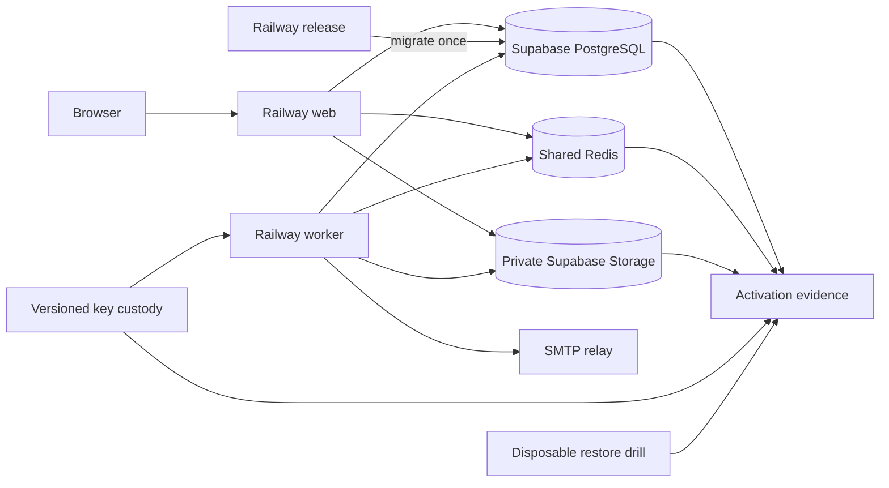
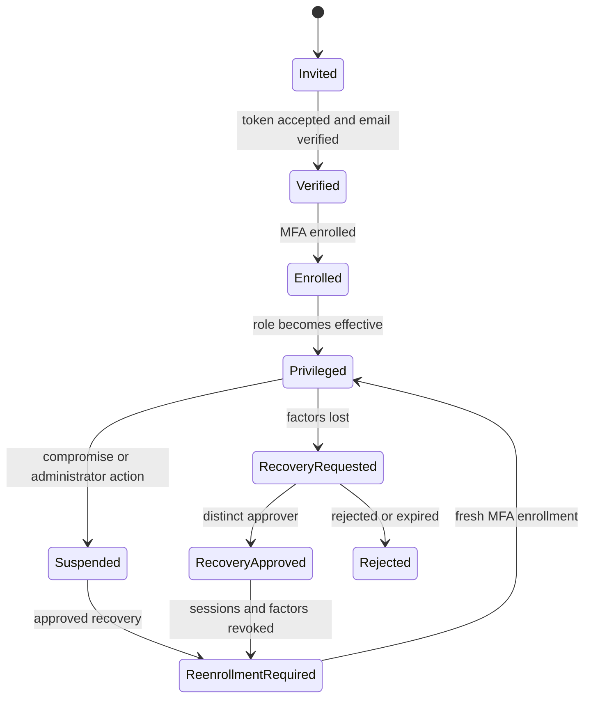

# MNEMEX Hosted Production Activation - Plan

## Goal Capsule

Build the remaining hosted security and operations boundary for MNEMEX. The work
adds shared MFA claim state, durable security notifications, staff invitation and
lost-factor recovery, encryption-key rotation, private hosted artifact storage,
Railway process definitions, recovery rehearsal, and objective activation evidence.

The result remains fail-closed. This plan does not provision a provider, use real
credentials or PII, send real mail, deploy a service, or enable privileged production
access. Those actions require a later owner-authorized activation decision supported
by the evidence produced here.

## Problem Frame

MNEMEX now has local MFA, tenant-scoped privileged workflows, durable migration jobs,
and private local artifacts. Those controls do not prove that a multi-process hosted
service is safe. One-time MFA claims currently depend on the configured Django cache.
Security mail has no durable delivery record. Encryption keys have no rehearsed
rotation lifecycle. Staff invitation and lost-factor recovery have no approved
operational workflow. Private artifacts have no hosted store. Railway process roles,
full restore evidence, and a single objective activation report do not exist.

A feature flag alone cannot close these gaps. Production privilege must remain off
until the hosted dependencies and human procedures fail safely and have repeatable
evidence.

## Product Contract

### Actors

- A1 Security administrator manages invitations, suspensions, and key-rotation
  requests but cannot approve their own privileged recovery.
- A2 Independent security approver reviews a privileged recovery for the same
  organization or platform scope.
- A3 Privileged operator receives an invitation, verifies email, enrolls MFA, and
  uses a fresh session before entering a workspace.
- A4 Web service serves the account and operator portals without performing schema
  migration or unbounded background work.
- A5 Release process owns schema migration and deployment checks once per release.
- A6 Worker service claims durable migration, artifact, and security-notification
  work with bounded retries and graceful drain.
- A7 Owner or incident lead reviews activation and recovery evidence without seeing
  contact values, TOTP secrets, recovery codes, object credentials, or private
  workbook contents.

### Requirements

#### Shared authentication controls

- R1. Production settings reject missing, malformed, placeholder, or mutually
  inconsistent cache, mail, proxy, encryption-key, object-store, database, and host
  configuration before a process can serve traffic.
- R2. One-time TOTP claims use a named shared security-cache operation that is atomic
  across web processes. One-use recovery-code consumption remains row-locked in
  PostgreSQL. A cache outage denies a TOTP claim and never falls back to process-local
  acceptance.
- R3. Application rate limits use the shared cache. Edge rate limits and the trusted
  client-IP header remain separately configured and documented. An untrusted request
  header cannot select its own rate-limit identity.
- R4. MFA ciphertext remains AES-GCM protected under a versioned key ring. Rotation
  supports an overlap window, bounded resumable re-encryption, historical-key restore,
  tamper rejection, and permanent failure when a required key is unavailable.

#### Security operations

- R5. Every security notification is first persisted as a PII-minimized intent in
  the same transaction as its audit boundary, then delivered by a fenced worker with
  bounded retry, terminal review, and observable queue age. An ambiguous SMTP outcome
  becomes delivery-uncertain review state instead of an automatic duplicate send.
  Contact-change notices target encrypted event-time snapshots of both prior and new
  verified addresses; other notices target the encrypted event-time verified address.
- R6. A privileged invitation is scope-bound, role-bound, hashed at rest, expiring,
  single-use, and invalid after cancellation, role-policy change, or account
  suspension. Acceptance requires verified email and MFA before any role becomes
  effective.
- R7. Privileged lost-factor recovery requires a request, a distinct authorized
  approver, a typed reason, a non-secret evidence reference, and a short approval
  lifetime. Approval revokes all sessions and existing factors before a new MFA
  enrollment can restore privileged access.
- R8. Suspected compromise follows the stricter recovery branch: suspend privilege,
  revoke sessions and factors, require an independent approval, and prevent the
  affected mailbox alone from authorizing recovery.
- R9. Invitation, recovery, suspension, notification, and key-rotation audit records
  never contain raw contact values, tokens, secrets, recovery codes, object paths, or
  message bodies. A pending notification may retain only versioned encrypted recipient
  ciphertext and an HMAC identity until its owner-approved retention deadline.

#### Hosted runtime and private objects

- R10. Private source artifacts use a storage interface with immutable
  digest-addressed references, exact digest and size verification, bounded reads,
  tenant-independent opaque paths, and no public URL or browser credential.
- R11. The hosted adapter uses a private Supabase Storage bucket through server-only
  credentials. Local development and tests keep the existing explicit-root adapter.
- R12. Railway has separate web and continuously supervised worker services plus one
  pre-deploy release command as the sole schema-migration owner. The worker drains on
  termination and does not accept HTTP traffic.
- R13. Liveness proves only process health. Readiness proves database and shared-cache
  access plus configuration integrity without sending mail, disclosing secrets, or
  mutating an artifact.
- R14. Queue depth, oldest-ready age, retry exhaustion, mail terminal failure,
  artifact reconciliation failure, restore drift, and privileged recovery events
  produce PII-minimized operational signals. Hosted activation additionally requires
  observed authenticated-sender, bounce, complaint, and recovery-abuse monitoring.

#### Recovery and activation

- R15. Database state, private objects, and required historical encryption keys are
  separate recovery dependencies. A database backup is never described as a private
  artifact backup.
- R16. A disposable recovery rehearsal restores PostgreSQL state, private objects,
  key access, notification/job leases, and artifact digests, then runs application
  reconciliation and records the result without real data.
- R17. A machine-readable activation report identifies each required gate, its
  evidence time, environment fingerprint, result, and expiry. A final hosted evidence
  bundle is signed by an offline owner-held Ed25519 key unavailable to web and worker
  services. Missing, stale, failed, unsigned, invalidly signed, or
  environment-mismatched evidence keeps the gate unsatisfied.
- R18. Production privileged authorization stays hard-disabled in this change. No
  report, management command, database row, or environment variable added here may
  enable it.
- R19. All automated acceptance uses synthetic identities, invalid-domain email
  addresses, isolated databases, disposable cache/object services, and no hosted
  project credential.
- R20. Hosted preparation does not change authority: shows own local operations and
  event state; MNEMEX owns portable identity and finalized history; race day uses a
  pinned local snapshot without a live MNEMEX dependency.

#### Operator safety and evidence

- R21. Privileged forms perform an in-page MFA freshness check before submission.
  Step-up preserves the browser's manual fields and selected file, issues a one-time
  action ticket bound to the browser session and route, and requires deliberate
  submission. The server never stores or automatically replays an unapproved body.
- R22. Activation requires a synthetic first-time-operator rehearsal in which an
  operator and distinct approver complete invitation and lost-factor recovery through
  the UI and runbook without database access.

### Product Key Decisions

- K1. Activation is an evidence-backed owner decision, not an automatic feature-flag
  transition. (session-settled: user-directed — chosen over enabling hosted privilege
  during this build: production PII, credentials, and privileged access remain outside
  the authorized boundary.) Governs R1-R4 and R12-R19.
- K2. Privileged recovery requires two distinct people. The requester's mailbox and
  password are not sufficient recovery authority. Governs R7-R9.
- K3. Railway and Supabase define the hosted provider shape, while provider
  provisioning remains outside this implementation. (session-settled: user-approved —
  chosen over an unspecified hosted target: the approved Results Desk direction uses
  Railway and Supabase but does not authorize credentials or deployment.) Governs
  R10-R17.
- K4. Race day remains independent of MNEMEX availability. (session-settled:
  user-directed — chosen over a live identity-service dependency: a pinned local
  profile and roster snapshot protects event operations.) Governs R20.

### Acceptance Examples

- AE1. Two web processes race to claim one valid TOTP value. Exactly one succeeds;
  both deny when the shared cache is unavailable.
- AE2. A password-only or stale-MFA session submits a privileged action. The action
  is denied before private data access and its body is not replayed automatically.
- AE3. A security mail transport fails after an MFA change commits. The account
  change remains committed, one notification intent retries, and no duplicate audit
  fact is created.
- AE4. An invitation token is replayed, expired, cancelled, or presented for the
  wrong account. It grants no role and reveals no account-existence distinction.
- AE5. A privileged operator loses every factor. A different authorized person
  approves recovery; existing sessions and factors are revoked; privilege stays
  unavailable until fresh MFA enrollment.
- AE6. The active MFA key changes while older ciphertext exists. Both versions read
  during overlap, a bounded rotation resumes after interruption, and retirement is
  blocked until no ciphertext needs the old key.
- AE7. A private object read returns the wrong size or digest. The operation fails,
  records a non-secret diagnostic, and never passes the bytes to an importer.
- AE8. A Railway web instance starts during a release. It never runs migrations;
  release failure prevents the new deployment from becoming ready.
- AE9. A synthetic restore has its database but omits one object or historical key.
  Reconciliation fails and the activation report remains unsatisfied.
- AE10. Every local and staging gate passes. Production privilege still remains off
  until a later explicit owner-authorized change.
- AE11. MFA freshness expires while an operator has a workbook and manual values in a
  form. In-page step-up retains both, then a deliberate fetch submission succeeds with
  a one-use action ticket; a server rejection leaves the form intact and never replays
  it.
- AE12. A representative first-time operator and independent approver complete a
  synthetic invitation and lost-factor recovery using only the documented UI and
  runbook; their observed result becomes distinct activation evidence.

## Key Technical Decisions

- KTD1. Use a named Django Redis cache with a pinned Redis client for shared TOTP
  claims, and a separately namespaced shared cache for application rate limits.
  One-use recovery codes retain their PostgreSQL row-lock contract. Cache-dependent
  security decisions fail closed; ordinary public rendering may degrade separately.
  Covers R1-R3 and AE1-AE2.
- KTD2. Persist security-notification intents in PostgreSQL and process them through a
  fenced queue modeled on `mnemex.legacy_migration.jobs`. Delivery identity is a
  stable template plus account reference, context code, deterministic Message-ID,
  encrypted event-time recipient, and recipient HMAC, not a stored message body or raw
  address. Delivery attempts retry only before SMTP acceptance; an ambiguous post-send
  outcome enters terminal delivery-uncertain review without automatic redelivery.
  Covers R5, R9, R14, and AE3.
- KTD3. Load the MFA key ring from strict versioned environment entries and keep the
  active version separate. A resumable rotation job rewrites authenticators only
  after decrypting and re-encrypting one locked batch; it never emits plaintext.
  Covers R1, R4, R9, R15-R17, and AE6.
- KTD4. Store invitation and recovery secrets only as keyed hashes with purpose,
  subject, scope, expiry, and security-version binding. Recovery approval must come
  from a distinct effective security administrator and results in session and factor
  revocation before re-enrollment. Covers R6-R9 and AE4-AE5.
- KTD5. Introduce a narrow private-object protocol and keep lifecycle truth in the
  existing PostgreSQL artifact records. The Supabase adapter uses a private bucket and
  verifies every read against the database digest and size. It does not treat Storage
  metadata tables as object backups. Covers R10-R11, R15-R16, and AE7-AE9.
- KTD6. Define Railway web and worker services separately, with one release command as
  the migration owner. Static assets are built into the web image. Worker loops call
  existing bounded one-shot functions and observe termination between units of work.
  Covers R12-R14 and AE8.
- KTD7. Generate activation evidence as immutable database records and a
  machine-readable report with named gate results and an environment fingerprint.
  Local reports are diagnostic. Final hosted evidence requires an offline owner
  signature verified against a pinned public key. The signing key is never present in
  web or worker services. `mnemex.web.settings.production` retains the hard false
  privileged flag. Covers R17-R19 and AE9-AE10.
- KTD8. Rehearse database, object, and key recovery as three inputs to one disposable
  verification workflow. Restore success requires application checks plus object
  digest reconciliation, not provider console status alone. Covers R15-R17 and AE9.
- KTD9. Add a vanilla-JavaScript pre-submit assurance layer that uses the existing MFA
  reauthentication flow in an accessible in-page dialog. After step-up, the server
  issues a short-lived one-use action ticket bound to session, account security
  version, route, method, and origin. Fetch submission keeps the form and file input in
  the page until success and never automatically retries. Covers R21 and AE2, AE11.

## High-Level Technical Design

The database is authoritative for queue, audit, invitation, recovery, and artifact
metadata. Redis holds short-lived coordination and rate-limit state only. Supabase
Storage holds opaque private bytes. Losing Redis may deny sensitive work but cannot
erase durable evidence. Losing an object or a required historical key makes recovery
incomplete and keeps activation closed.

## Planning Contract

### Assumptions

- The hosted cache is Redis-compatible and supplied through a secret URL. Provider
  creation and credential entry are later operator actions.
- SMTP is provider-neutral. The implementation uses Django's mail interface and does
  not select or provision a mail vendor. Sender authentication, bounce, complaint,
  and recovery-abuse monitoring remain pending gates until observed in staging.
- The edge proxy supplies one documented client-IP header only after Railway proxy
  behavior is verified. Until then, the application does not trust forwarded headers
  for rate-limit identity.
- Security administrator is a new platform-scoped privileged role. Existing results,
  identity, and export roles cannot approve account recovery unless separately
  assigned that role.
- A recovery evidence reference is an opaque ticket or offline-verification reference.
  The application does not store identity-document images or free-form sensitive
  evidence.
- Supabase Storage is private and server-only. Browser uploads continue through the
  MNEMEX web service so provider credentials never reach a client.
- The owner must approve retention periods for invitations, recoveries, notification
  recipient ciphertext, and audit metadata. Local code enforces configured periods,
  but the activation gate stays pending until the policy and deletion evidence exist.
- Production activation evidence may include staging observations that require later
  hosted access. Such gates remain pending in local development rather than being
  simulated as passed.

### U1. Add strict hosted configuration and shared-cache gates

**Goal:** Make hosted processes reject unsafe configuration and prove that MFA claims
and rate limits use shared atomic state.

**Requirements:** R1-R3, R13, R17-R19. **Acceptance:** AE1-AE2, AE10.

**Dependencies:** none.

**Files:**

- `pyproject.toml`
- `mnemex/web/settings/base.py`
- `mnemex/web/settings/production.py`
- `mnemex/web/checks.py`
- `mnemex/web/health.py`
- `mnemex/accounts/forms.py`
- `tests/test_production_configuration.py`
- `tests/test_accounts_shared_cache.py`

**Approach:** Add strict parsers for cache, proxy, mail, object-store, and versioned-key
configuration. Register deployment checks that report stable reason codes without
values. Configure named shared cache aliases for allauth throttles and TOTP claims.
Readiness
uses a bounded non-mutating database check and a namespaced cache round trip. Keep
privileged production authorization hard false per KTD7.

**Test scenarios:**

- Reject absent, placeholder, non-TLS, malformed, and mutually inconsistent hosted
  settings before application startup.
- Race two isolated processes against one disposable Redis instance and observe one
  successful claim.
- Preserve row-locked one-use recovery-code consumption in PostgreSQL without routing
  it through Redis.
- Simulate cache timeout and corruption; deny the sensitive action without local
  fallback.
- Prove untrusted forwarded headers do not alter the rate-limit identity.
- Return redacted readiness failures and keep liveness independent of dependencies.

**Verification:** Focused tests pass on isolated SQLite and disposable PostgreSQL;
the Redis concurrency test passes against a disposable loopback service; deployment
checks produce only stable non-secret diagnostics.

### U2. Add the durable security-notification outbox

**Goal:** Deliver security mail without coupling credential state to a best-effort
SMTP call.

**Requirements:** R5, R9, R12, R14, R17-R19. **Acceptance:** AE3, AE10.

**Dependencies:** U1.

**Files:**

- `mnemex/accounts/models.py`
- `mnemex/accounts/migrations/0005_security_notification_outbox.py`
- `mnemex/accounts/notifications.py`
- `mnemex/accounts/adapters.py`
- `mnemex/accounts/signals.py`
- `mnemex/worker.py`
- `tests/test_security_notification_outbox.py`
- `tests/test_security_notification_worker.py`

**Approach:** Follow the durable migration-job lease and settlement pattern without
sharing domain models. Queue a template identifier, account reference, context code,
idempotency key, deterministic Message-ID, encrypted event-time recipient, and
recipient HMAC. After allauth persists a verified contact change, MNEMEX snapshots
the prior and new verified destinations into durable queue intents. If enqueueing
fails, the account mutation remains committed, a PII-free audit or redacted log signal
is emitted, and SMTP is not called on the request path. Record bounded attempt state,
lease fencing, delivery
time, delivery-uncertain review state, retention deadline, and redacted audit events.
Never store a rendered subject, body, or raw address.

**Test scenarios:**

- Commit an account-security change while SMTP is unavailable; retain one queued
  intent and unchanged credential state.
- Claim concurrently on PostgreSQL and deliver once.
- Reclaim an expired lease, stop gracefully, apply bounded backoff, and terminalize
  exhausted delivery without duplicate mail.
- Simulate process loss before SMTP acceptance and retry safely; simulate an ambiguous
  loss after acceptance and require review without automatic redelivery.
- Change or remove the verified address before claim and deliver to the event-time
  snapshot without exposing either value.
- Expire recipient ciphertext under the configured retention policy while preserving
  a non-reversible audit outcome.
- Keep authenticated-sender, bounce, complaint, and recovery-abuse gates pending until
  staging evidence is supplied.
- Keep worker output, audit events, and errors free of recipient and body content.

**Verification:** Notification domain, worker, concurrency, and migration tests pass;
the existing account/MFA and durable-worker suites remain green.

### U3. Add encryption-key lifecycle and rotation tooling

**Goal:** Make authenticator encryption restorable and rotatable without plaintext
fallback or unbounded rewrites.

**Requirements:** R1, R4, R9, R14-R19. **Acceptance:** AE6, AE9-AE10.

**Dependencies:** U1, U2.

**Files:**

- `mnemex/accounts/adapters.py`
- `mnemex/accounts/keyring.py`
- `mnemex/accounts/models.py`
- `mnemex/accounts/migrations/0006_key_rotation_jobs.py`
- `mnemex/accounts/key_rotation.py`
- `mnemex/worker.py`
- `tests/test_mfa_keyring.py`
- `tests/test_mfa_key_rotation.py`

**Approach:** Parse a strict version-to-key map and active version. Add an audited,
fenced rotation job with a deterministic cursor and bounded batches. Each row is
locked, decrypted with its declared version, re-encrypted with the active version,
and verified before commit. Rotation refuses retirement while ciphertext, backup
evidence, or a running job still requires the old version.

**Test scenarios:**

- Reject duplicate versions, invalid key lengths, missing active versions, placeholder
  key material, and removal of a required historical version.
- Read old and new ciphertext during overlap and reject tampering or unknown versions.
- Interrupt rotation after a committed batch; resume without rewriting completed rows
  or exposing plaintext.
- Race claimers on PostgreSQL and preserve lease fencing.
- Restore a synthetic database with the complete key ring, then fail predictably when
  one historical version is absent.

**Verification:** Key parsing, cryptography, resumability, PostgreSQL concurrency, and
restore tests pass; logs and persisted diagnostics contain no key or plaintext bytes.

### U4. Add privileged invitation and lost-factor recovery workflows

**Goal:** Give security staff a usable, audited way to onboard and recover privileged
operators without a password-only bypass.

**Requirements:** R6-R9, R14, R17-R20. **Acceptance:** AE4-AE5, AE10.

**Dependencies:** U1-U3.

**Files:**

- `mnemex/accounts/authorization.py`
- `mnemex/accounts/models.py`
- `mnemex/accounts/migrations/0007_privileged_account_operations.py`
- `mnemex/accounts/services.py`
- `mnemex/accounts/forms.py`
- `mnemex/accounts/views.py`
- `mnemex/accounts/urls.py`
- `mnemex/accounts/templates/accounts/security_operations/**`
- `tests/test_privileged_invitations.py`
- `tests/test_privileged_recovery.py`
- `tests/test_security_operations_portal.py`

**Approach:** Add the security-administrator role and tenant/platform scope rules.
Create immutable invitation and recovery evidence plus narrowly mutable operational
state. Hash tokens with purpose separation and bind them to account security version.
Require a distinct approver for recovery. On approval, increment security version,
revoke sessions, remove authenticators and recovery codes, suspend role effectiveness,
and require enrollment before restoration. Build a non-technical queue and detail UI
that displays a stable non-secret request identifier, external evidence reference,
requested role and scope, state, age, expiry, approval status, next action, and reason
codes without contact values or secrets. Approval requires confirming that the
external evidence reference matches.
Invitation links carry only a non-secret request identifier. The secret code is
entered in a CSRF-protected POST form and is excluded from URLs, referrers, analytics,
and application or proxy logs.

**Test scenarios:**

- Accept one valid invitation through verified email and MFA enrollment; reject token
  replay, expiry, cancellation, wrong subject, role-policy drift, and suspension.
- Prove invitation secrets never appear in a URL, referrer, browser-history assertion,
  request log, error page, or analytics payload.
- Prove absent and unauthorized invitation or recovery identifiers are
  indistinguishable.
- Reject self-approval, wrong-scope approval, stale approval, and mailbox-only
  compromise recovery.
- Revoke every existing session and factor, keep privilege off during re-enrollment,
  and emit one durable notification per state transition.
- Verify keyboard, mobile, error, and empty-state behavior without exposing PII.
- Distinguish several same-scope requests from the queue and require the approver to
  match the external evidence reference before acting.

**Verification:** Domain, portal, enumeration, session-revocation, MFA, RBAC, and
notification integration tests pass on SQLite and PostgreSQL; browser QA confirms the
operator workflow is understandable without technical knowledge.

### U5. Add private Supabase artifact storage

**Goal:** Preserve the artifact lifecycle and provenance contract on hosted private
object storage.

**Requirements:** R1, R9-R11, R14-R19. **Acceptance:** AE7, AE9-AE10.

**Dependencies:** U1.

**Files:**

- `mnemex/results/artifacts.py`
- `mnemex/results/artifact_lifecycle.py`
- `mnemex/results/views.py`
- `mnemex/legacy_migration/private_workbooks.py`
- `mnemex/worker.py`
- `tests/test_supabase_private_artifacts.py`
- `tests/test_artifact_object_lifecycle.py`

**Approach:** Extract a minimal private-object protocol from the local adapter. Add a
Supabase implementation selected only by strict hosted settings. Use opaque
digest-addressed keys and server-only access. Verify digest and size after upload and
before every consumer read. Preserve the pending-write ledger, exact-reference
cleanup, reconciliation worker, and no-public-URL contract.

**Test scenarios:**

- Keep local adapter behavior and every existing artifact lifecycle regression green.
- Reject public bucket configuration, path traversal, oversized reads, wrong digest,
  wrong size, missing object, and inconsistent provider response.
- Race identical uploads and a failed peer without deleting the committed object.
- Reconcile database-only and object-only drift using stable redacted outcomes.
- Exercise the hosted adapter against a disposable fake or local endpoint; keep a real
  staging-provider proof as a pending activation gate.

**Verification:** Contract tests pass for both adapters; lifecycle and importer suites
remain green; no test connects to a hosted Supabase project.

### U6. Add Railway process definitions, supervised workers, and signals

**Goal:** Make the intended hosted process topology reproducible without mixing web,
release, and background responsibilities.

**Requirements:** R1, R5, R12-R14, R17-R20. **Acceptance:** AE3, AE8, AE10.

**Dependencies:** U1-U5.

**Files:**

- `Dockerfile`
- `.dockerignore`
- `deploy/railway/web.json`
- `deploy/railway/worker.json`
- `pyproject.toml`
- `mnemex/worker.py`
- `mnemex/web/settings/production.py`
- `mnemex/web/health.py`
- `tests/test_railway_process_contract.py`
- `tests/test_supervised_worker.py`

**Approach:** Build one immutable image and serve collected static assets through
WhiteNoise. Configure the web service with a bounded start command and readiness path. Configure one
pre-deploy release command as schema owner. Run a supervised worker loop that calls
bounded artifact, migration, notification, and key-rotation batches; applies jittered
idle delay; drains between claims; and exits nonzero only for persistent unhealthy
state. Emit structured counters and ages without identifiers. Use expand-and-contract
schema changes compatible with old and new web and worker versions, ordered service
promotion, version-skew tests, and application rollback against the forward schema.

**Test scenarios:**

- Prove the web command never migrates schema and the worker exposes no HTTP listener.
- Fail release on migration or deployment-check error before readiness.
- Build and serve a fingerprinted static asset through the production middleware.
- Run old/new web and worker versions against the expanded schema, then verify ordered
  promotion and rollback without reversing migrations.
- Terminate the worker before claim and between chunks; preserve durable work and
  reclaim safely.
- Exercise queue starvation prevention and bounded per-domain work.
- Verify health and metrics payloads contain stable codes and counts only.

**Verification:** Container configuration tests, supervised-worker tests, Django
deployment checks, and a local synthetic image smoke test pass without network
credentials.

### U7. Add backup inventory and disposable recovery rehearsal

**Goal:** Prove that PostgreSQL, private objects, and key versions can be restored into
one coherent synthetic MNEMEX environment.

**Requirements:** R4, R9-R10, R14-R17, R19-R20. **Acceptance:** AE6-AE7, AE9-AE10.

**Dependencies:** U2-U6.

**Files:**

- `mnemex/recovery/apps.py`
- `mnemex/recovery/models.py`
- `mnemex/recovery/migrations/0001_initial.py`
- `mnemex/recovery/services.py`
- `mnemex/recovery/management/commands/rehearse_restore.py`
- `mnemex/web/settings/base.py`
- `tests/test_recovery_inventory.py`
- `tests/test_recovery_rehearsal.py`
- `docs/runbooks/mnemex-backup-and-restore.md`

**Approach:** Record an immutable recovery manifest with database snapshot identity,
object inventory digest, required key versions, application schema version, and
environment fingerprint. The rehearsal command accepts only disposable targets,
restores synthetic inputs, clears stale leases safely, runs system and application
reconciliation, and writes a redacted result. Provider-native backups remain inputs,
not proof of application recovery. Register `mnemex.recovery` in `INSTALLED_APPS` so
migrations and commands are discoverable.

**Test scenarios:**

- Refuse a non-disposable target before connecting or mutating state.
- Restore a synthetic event, notification, invitation/recovery history, migration
  checkpoint, and artifact inventory into a new PostgreSQL database.
- Detect an omitted, altered, or extra object and a missing historical key.
- Normalize expired leases without replaying completed work or losing terminal
  evidence.
- Run the complete rehearsal twice and obtain deterministic evidence without touching
  any prior environment.

**Verification:** Recovery tests pass on a disposable PostgreSQL cluster and private
object fixture; the exact disposable targets are stopped and removed after evidence
capture.

### U9. Preserve privileged form state during MFA step-up

**Goal:** Prevent stale MFA from discarding manual entries or a selected workbook
without weakening the no-replay security boundary.

**Requirements:** R2, R21. **Acceptance:** AE2, AE11.

**Dependencies:** U1, U4.

**Files:**

- `mnemex/accounts/action_assurance.py`
- `mnemex/accounts/decorators.py`
- `mnemex/accounts/views.py`
- `mnemex/accounts/urls.py`
- `mnemex/accounts/templates/accounts/action_step_up.html`
- `mnemex/results/templates/results/base.html`
- `mnemex/results/static/results/privileged-submit.js`
- `mnemex/results/views.py`
- `mnemex/legacy_migration/views.py`
- `mnemex/career/views.py`
- `mnemex/export/views.py`
- `tests/test_privileged_action_step_up.py`
- `tests/test_results_desk_operator_hardening.py`

**Approach:** Add an accessible in-page dialog that completes the existing allauth MFA
reauthentication flow without navigating away from the form. After success, issue a
one-use action ticket through the named shared security cache. Bind it to the browser
session, account security version, exact route, method, and same-origin request. The
script submits `FormData` through fetch only after the operator confirms submission.
It keeps the original page and file input until a successful response directs the
browser onward. The server atomically claims the ticket before private-data access.
No-JavaScript and expired-ticket paths retain the existing fail-closed denial and never
replay a request.

**Test scenarios:**

- Fill manual rows and select a synthetic workbook, expire MFA, complete in-page
  step-up, and verify both remain selected before deliberate submission.
- Reject absent, expired, replayed, cross-session, cross-account, wrong-route,
  wrong-method, wrong-origin, and old-security-version tickets before reading a file
  or form body into domain services.
- Race two submissions with one ticket and accept exactly one through disposable
  Redis.
- Return a recoverable in-page error for server rejection while retaining form state
  and never automatically resubmitting.
- Preserve keyboard focus, error announcement, escape behavior, mobile layout, and the
  secure no-JavaScript fallback.

**Verification:** Focused browser and request tests prove form-state preservation,
one-use ticket binding, fail-before-private-access behavior, and no replay across every
privileged portal.

### U8. Add the activation report, runbooks, and independent acceptance gate

**Goal:** Turn all readiness requirements into one reviewable fail-closed decision
artifact while retaining the existing authority boundary.

**Requirements:** R1-R22. **Acceptance:** AE1-AE12.

**Dependencies:** U1-U7, U9.

**Files:**

- `mnemex/activation/checks.py`
- `mnemex/activation/apps.py`
- `mnemex/activation/models.py`
- `mnemex/activation/migrations/0001_initial.py`
- `mnemex/activation/report.py`
- `mnemex/activation/management/commands/activation_report.py`
- `mnemex/web/settings/base.py`
- `tests/test_activation_report.py`
- `docs/runbooks/mnemex-railway-supabase.md`
- `docs/runbooks/mnemex-security-operations.md`
- `docs/plans/2026-08-18-mnemex-hosted-production-activation-status.md`
- `README.md`

**Approach:** Define a closed registry of gates with stable identifiers, evidence
source, freshness, environment binding, and pass criteria. Persist immutable evidence
records and register `mnemex.activation` in `INSTALLED_APPS`. Generate JSON and a
human summary without secrets. Verify final hosted bundles against a pinned owner
public key; the private signing key remains offline. Local-only and unexercised hosted
gates report pending, not passed. Document deployment, rollback, alert response, key
compromise, mail failure, staff recovery, object restore, retention, and explicit
activation ownership. Run independent
security, correctness, data-integrity, recovery, and operator-UX reviews. Fix every
actionable high-confidence issue caused by or blocking R1-R22 and U1-U9 before closing
the implementation slice; record unrelated findings as follow-up work.

**Test scenarios:**

- Reject missing, stale, unknown, duplicated, tampered, or wrong-environment evidence.
- Reject unsigned or invalidly signed hosted bundles and accept a valid owner signature
  without exposing the private key to application processes.
- Keep the report deterministic and free of hostnames, credentials, emails, account
  identifiers, tokens, object references, and secret values.
- Show local code gates as passed and provider/staging observations as pending.
- Record a distinct synthetic first-time-operator rehearsal in which the operator and
  approver use only the UI and runbook; leave it pending until observed.
- Prove no report or command can change the production privileged setting or role
  effectiveness.
- Trace every requirement and acceptance example to an automated or explicitly
  operator-observed gate.

**Verification:** The complete SQLite suite, complete disposable PostgreSQL suite,
focused Redis/object/container/recovery gates, static analysis, migration drift,
deployment checks, browser QA, and independent reviews have scoped recorded outcomes.

## Verification Contract

- Every feature-bearing unit starts with a focused failing contract on the isolated
  Django test settings before production code changes.
- SQLite is the fast integration layer. It must not be reported as evidence for row
  locking, competing claimers, PostgreSQL constraints, or restore behavior.
- PostgreSQL acceptance uses a unique disposable local database or cluster. It covers
  migrations, constraints, claim races, lease takeover, outbox delivery settlement,
  recovery, and the aggregate account/results/legacy/export regression set.
- Shared-cache acceptance uses a disposable loopback Redis service and multiple
  processes. Mock-only cache tests do not satisfy R2.
- SMTP acceptance uses a synthetic local transport or instrumented backend. It never
  sends to a routable address.
- Supabase adapter tests use a fake or disposable local endpoint. A real private-bucket
  smoke test remains a named pending activation gate until staging credentials are
  separately authorized.
- The recovery rehearsal refuses production-like targets, inventories every mutated
  disposable resource, and removes only those exact resources after completion.
- Static gates include formatting, lint, typing, Django system and deployment checks,
  migration drift, dependency audit, and secret scanning when the corresponding local
  tools are available. Unavailable tools are recorded, not reported as passed.
- Browser QA exercises invitation, recovery, queue, error, stale-session, and mobile
  flows with synthetic data and keyboard navigation.
- Final review is adversarial and independent of the implementer. It covers security,
  tenant isolation, concurrency, data integrity, restore safety, operator recovery,
  and documentation truthfulness.

## Definition of Done

- U1-U9 meet their test scenarios and verification outcomes without using production
  state, hosted credentials, or real PII.
- Configuration, cache, mail, key, invitation/recovery, object, worker, recovery, and
  activation-report contracts fail closed under their named error conditions.
- Existing account, Results Desk, legacy migration, career, export, and STRATHMARK
  evidence behavior remains green within explicitly reported test scope.
- Runbooks identify an owner, precondition, observable result, rollback, and escalation
  boundary for each hosted operation without inventing response-time promises.
- Hosted-only observations that were not run remain pending in the activation report.
- Owner-approved retention, authenticated-sender, bounce, complaint, and
  recovery-abuse evidence remain required hosted gates.
- `MNEMEX_PRIVILEGED_AUTHORIZATION_ENABLED` remains false in production settings.
- No code or documentation claims that MNEMEX is production-ready, public-profile
  ready, portable-profile complete, or safe as a race-day network dependency.

## Success Criteria

- A new operator can complete invitation or approved lost-factor recovery from the UI
  without database access or a password-only bypass.
- A single cache, mail, object, database, key, or worker failure produces a bounded,
  recoverable, PII-minimized outcome.
- A reviewer can determine why activation is closed from one report without reading
  source code or secret configuration.
- A disposable restore reconstructs all three recovery dependencies and detects any
  deliberately omitted object or key version.
- The implementation leaves a clean boundary between locally proven code and hosted
  evidence that still requires owner-authorized staging work.

## System-Wide Impact

- Account mutations gain durable notification side effects, but notification failure
  never rolls back completed credential state.
- Authentication and allauth throttling become dependent on shared cache availability
  for sensitive paths. Cache outage is an intentional availability-for-security
  tradeoff.
- The Account domain gains security-administrator, invitation, recovery, notification,
  and rotation state. Existing role scopes and tenant rules remain authoritative.
- Results and legacy migration artifact consumers move behind a storage protocol. The
  database provenance and lifecycle models remain authoritative.
- The worker becomes continuous and multi-queue. Fairness, bounded work, lease
  fencing, graceful drain, and PII-minimized signals apply across domains.
- Deployment gains a release role and immutable image. The web process stops being an
  accidental migration owner.
- Recovery becomes an application-level contract across database, objects, and keys.
  Provider backup status alone is insufficient.
- Production privilege does not change. Portable profile, public career pages, show
  adapters, and pinned roster delivery remain later product work.

## Risks and Dependencies

- Redis cache operations and client-IP identity are security boundaries. Mitigation:
  require cross-process atomic tests, explicit trusted-proxy configuration, and
  fail-closed outage behavior.
- Mail is eventually delivered and may be delayed. Mitigation: persist intent before
  delivery, expose queue age and terminal state, and never use mail delivery as the
  transaction commit boundary.
- Two-person recovery can reduce availability when staff is limited. Mitigation:
  support platform-scoped independent approvers and documented offline escalation;
  never weaken to same-person approval.
- Historical-key loss makes some authenticators unrecoverable. Mitigation: block key
  retirement until ciphertext and restore evidence are clear, and rehearse key access
  separately from database restore.
- Supabase Storage has a separate object lifecycle from PostgreSQL. Mitigation: keep
  an application inventory, back up objects separately, and verify digests after
  restore.
- A continuous multi-queue worker can starve one domain. Mitigation: fixed per-domain
  batch limits, rotating order, oldest-ready metrics, and bounded loop work.
- Railway pre-deploy commands run outside the serving container filesystem.
  Mitigation: build static assets into the image and reserve pre-deploy for database
  migration and checks.
- The current tree contains substantial uncommitted collaborative work. Mitigation:
  preserve every unrelated change, edit unit-owned files narrowly, and do not stage,
  commit, push, or deploy in this execution.

## Scope Boundaries

### In scope

- All code, tests, synthetic fixtures, configuration templates, local rehearsals,
  runbooks, and activation evidence named by U1-U9.
- Safe refactoring needed to place existing local artifact and worker behavior behind
  the new hosted contracts.

### Outside this change

- Creating Railway, Supabase, Redis, SMTP, DNS, monitoring, or secret-manager
  resources.
- Entering, rotating, or testing a real credential; sending a real email; ingesting
  real competitor data; or enabling a public profile.
- Enabling production privileged authorization or assigning a real staff role.
- Deploying, committing, staging, pushing, opening a pull request, or merging.
- Completing universal profile portability, show adapters, pinned race-day roster
  export, partner onboarding, payment, waiver, scoring, or direct STRATHMARK writes.

## Documentation and Operational Notes

- Mark the legacy direct-Supabase setup and RLS instructions as deprecated wherever
  they still look executable. Do not adapt their direct-client or wipe/reseed workflow.
- Railway service configuration must point each service to its own config file. The
  release command is the sole schema-migration owner.
- The runbook must state that Supabase database backups exclude Storage objects and
  that object export and restore are separate operations.
- The runbook must describe staging evidence as pending until it is actually observed.
  It must never offer a command that silently turns privilege on after a local pass.
- Retain the pinned local race-day snapshot boundary in every deployment and incident
  procedure.

## Sources and Research

- Repository authority and current gates:
  `docs/plans/2026-08-17-mnemex-account-security-status.md`,
  `docs/plans/2026-08-17-mnemex-durable-migration-worker-status.md`,
  `docs/plans/2026-08-15-mnemex-private-artifact-lifecycle-status.md`, and
  `docs/plans/2026-08-14-mnemex-universal-profile-architecture.md`.
- Django deployment checklist:
  <https://docs.djangoproject.com/en/5.2/howto/deployment/checklist/>.
- django-allauth rate limits and cache dependence:
  <https://docs.allauth.org/en/latest/account/rate_limits.html>.
- Railway configuration and pre-deploy behavior:
  <https://docs.railway.com/config-as-code/reference> and
  <https://docs.railway.com/deployments/pre-deploy-command>.
- Supabase database backup scope and restore behavior:
  <https://supabase.com/docs/guides/platform/backups> and
  <https://supabase.com/docs/guides/platform/clone-project>.
- Supabase Storage object handling and backup boundary:
  <https://supabase.com/docs/guides/storage/management/download-objects> and
  <https://supabase.com/docs/guides/storage/s3/compatibility>.
